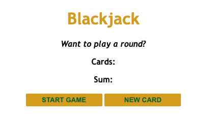

# Black Jack

I'm not into gambling but I do like playing boardgames. Whenever I teach students, I try to have fun with it and implement educational games. It would be interesting to build some virtual games in the future.

For now, here's a game I learned how to build!

## This is what the landing page looks like

## Click on START GAME to deal your first cards

## Click on NEW CARD to deal another card if you'd like to try your luck and get 21

## If you go over 21, the message changes to "You're out of the game!"...

# ...but if you get 21, the message reads "You've got Blackjack!"

Whether you're out of the game or get blackjack, you're always welcome to play another round by refreshing your browser and starting a new game.

## Special thanks to: 

Per Herald Borgen at Scrimba